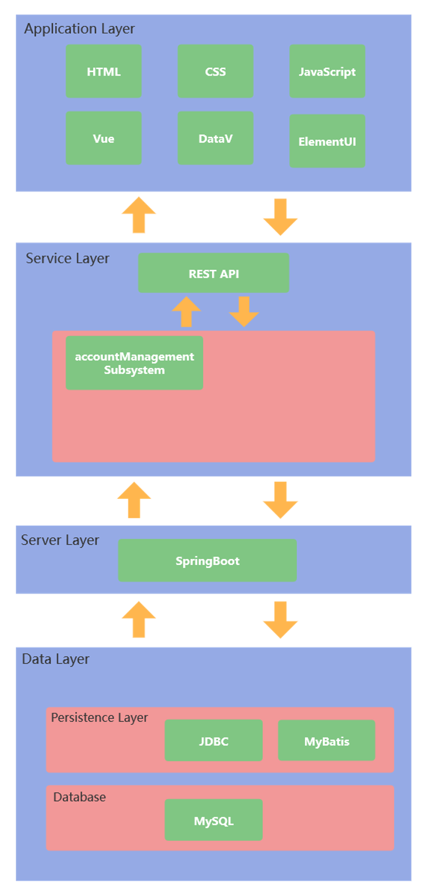

修订历史:

修改或初始编写日期、 SEPG、 版本、 说明、 作者、 评审时间、 评审参与人员、 评审后修改批准日期、确认签字人员

目　录

# 1. 引言 yj

## 1.1. 概要设计目的和依据

编写这份概要说明书的目的是简要介绍本项目的架构设计、接口设计、界面设计、数据库设计以及出错处理。本文档的预期读者是与本项目开发有联系的决策人、开发组人员、支持本项目的利益相关者等。

本概要设计依据文件：超链接到需求分析说明书。

## 1.2. 参考资料 

需求分析说明书

## 1.3. 假定和约束 

系统运行使用的最短寿命：3年

经费来源和使用限制：无经费

法律和政策限制：不得随意泄露数据

建议投入使用的最迟时间：2022年1月

用户假设：本系统的用户能够操作键盘和鼠标，能够浏览简单的网站。

# 2. 概要设计

## 2.1. 系统总体架构设计 lwy

参考第二份作业的SDS的P6

图片要改

以需求分析为依据，进一步详细设计系统的总体架构设计。本系统服务器端设计以实现各模块间的低耦合及模块内部的高内聚为导向，系统被具体细分为四个层 ：应用层（ApplicationLayer）、业务层（ServiceLayer）、数据层（DataLayer）以及服务层（ServerLayer）。

1. 应用层：主要包含了当前web前端的技术需求。PC端主要采用Vue框架，并通过ElementUI、DataV、ECharts等组件库构造快速动态的大屏数据展示页面，通过axios发送http请求。无论是用户还是管理者，均通过应用层提供的Web 服务器使用本平台所提供的功能，发送的信息将被统一转化为JSON格式的数据发送到服务层。
2. 业务层中：接口按照对应的子系统进行划分为账户管理。之后随着业务需求更新可增加其他业务子系统。
3. 数据层：主要实现的是本平台数据库的访问和配置。访问的方式主要为JDBC，并且我们使用 Java 中的 ORM 框架 MyBatis 简化代码，提高开发效率。而底层数据库则包含了关系型数据库 MySQL。
4. 服务层：基于SpringBoot进行开发。

## 2.2. 系统软件结构设计 yj

可参考第二份作业的SDS的P8

## 2.3. 接口设计 yj（和外面的）&lwy（前后端）

## 2.4. 界面设计 yj&lwy

## 2.5 数据库设计 lwy

## 2.6 系统出错处理设计 yj&lwy

### 2.6.1 出错信息

### 2.6.2 补救措施

### 2.6.3 系统维护设计

# 附录